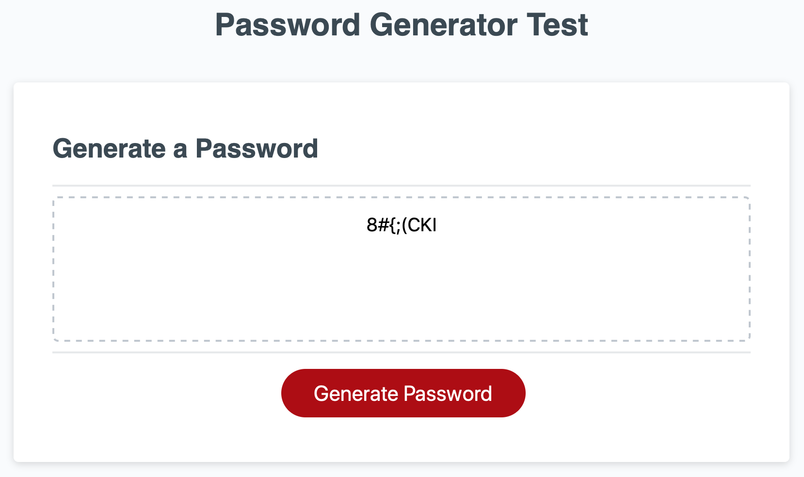
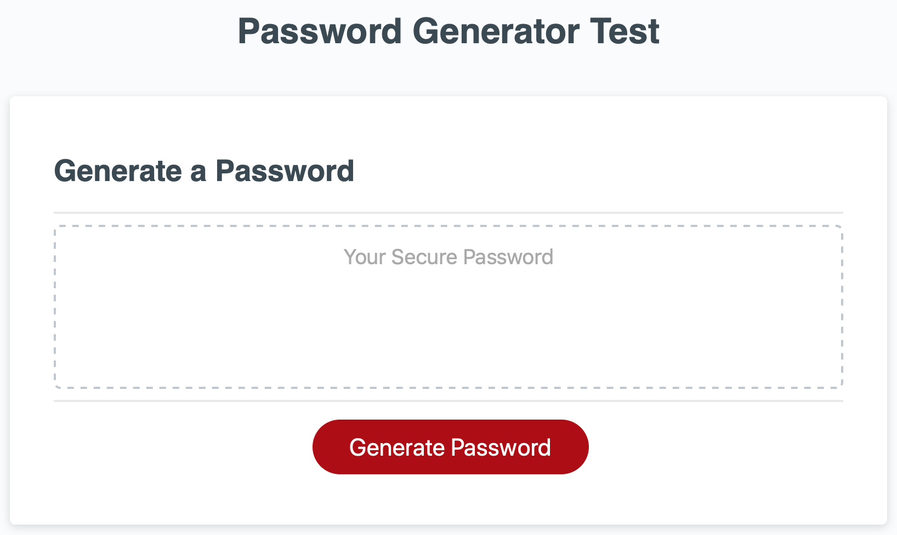

# Random Password Generator using Javascript

## For the user who would like to:
- create a random password based on the criteria that was given by the user
- create a strong password that provides higher security

## How it works:
When the user clicks `Generate Password`, 
1. Prompt pops up asking the user to choose the password length, number between 8-128.
    - if the user choose the number less than 8 or greater than 128, alert pops up saying 'Please select a number between 8-128', then returns to the beginning page with an empty string in the box
    - if the user choose `cancel`, then returns to the beginning page with an empty string in the box
    - if the user choose the number within the range of criteria, then proceed to the next step
2. Prompt pops up asking if the user wants to inclde numbers (yes or no). 
    Proceed to the next step
3. Prompt pops up asking if the user wants to include lower case alphabets (yes or no). 
    Proceed to the next step
4. Prompt pops up asking if the user wants to include upper case alphabets (yes or no). 
    Proceed to the next step
5. Prompt pops up asking if the user wants to include special characters (yes or no). 
    Proceed to the next step
6. After the user answered previous questions, returns to the beginning page with a randomly generated password with numbers/lower case/upper case/special characters based on the user input

## Features:
1. The user can select the criteria for the password:
    - Password Length
    - Numeric Characters
    - Lowercase Characters
    - Uppercase Characters
    - Special Characters

    ### Example:
    Based on the answers by user, chracters from each array adds into the possibleChars array.
    ```javascript
    var numericIncluded = window.confirm ("Do you want to include numbers?");
    switch (numericIncluded) {
      case true:
        possibleChars = numeric;
        break;
    }
    var lowercaseIncluded = window.confirm("Do you want to include lowercase?");
    switch (lowercaseIncluded) {
      case true:
        possibleChars = [].concat(possibleChars, lowercase);
        break;
    }
    var uppercaseIncluded = window.confirm("Do you want to include uppercase?");
    switch (uppercaseIncluded) {
      case true:
        possibleChars = [].concat (possibleChars, uppercase);
        break;
    }
    var specialcharIncluded = window.confirm("Do you want to include special characters?");
    switch (specialcharIncluded) {
      case true:
        possibleChars = [].concat (possibleChars, specialCharacters);
        break;
    }
    ```
    
    If the user wanted 8 characters long, selected `yes` for numbers, uppercase, and special characters, the page will provide a randomly generated password:

    


2. When the user does not want to create a password:
    - the user can choose cancel when the prompt is asking for its length. The user will return to this:

    

    ### Example:
    ```javascript
      else if (isNaN) {
        return ""
      }
    ```

